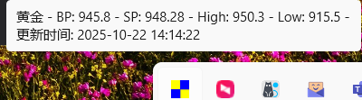

# Gold Price Viewer

## 项目简介
Gold Price Viewer 是一个用于查看黄金价格的程序。
它可以从指定的数据源获取黄金价格并以Windows状态栏托盘中展示。<>br/
<br/>
该数据5秒刷新一次。
右键点击状态栏图标，可以手动刷新数据。

## 安装指南

### 1. 克隆项目
使用以下命令克隆项目到本地：
```bash
git clone https://github.com/YeezB/gold-price-viewer
cd Gold_price_viewer
```

### 2. 安装依赖
确保已安装 Python 3.7 或更高版本。然后运行以下命令安装 `requirements.txt` 中的依赖：
```bash
pip install -r requirements.txt
```

### 3. 运行程序
运行以下命令启动程序：
```bash
python gold_price_viewer.py
```

## 注意事项
- 请确保您的网络连接正常，以便程序能够获取实时数据。
- 如果遇到任何问题，请检查 `requirements.txt` 中的依赖是否正确安装。

## 贡献
欢迎提交 issue 或 pull request 来改进本项目。
